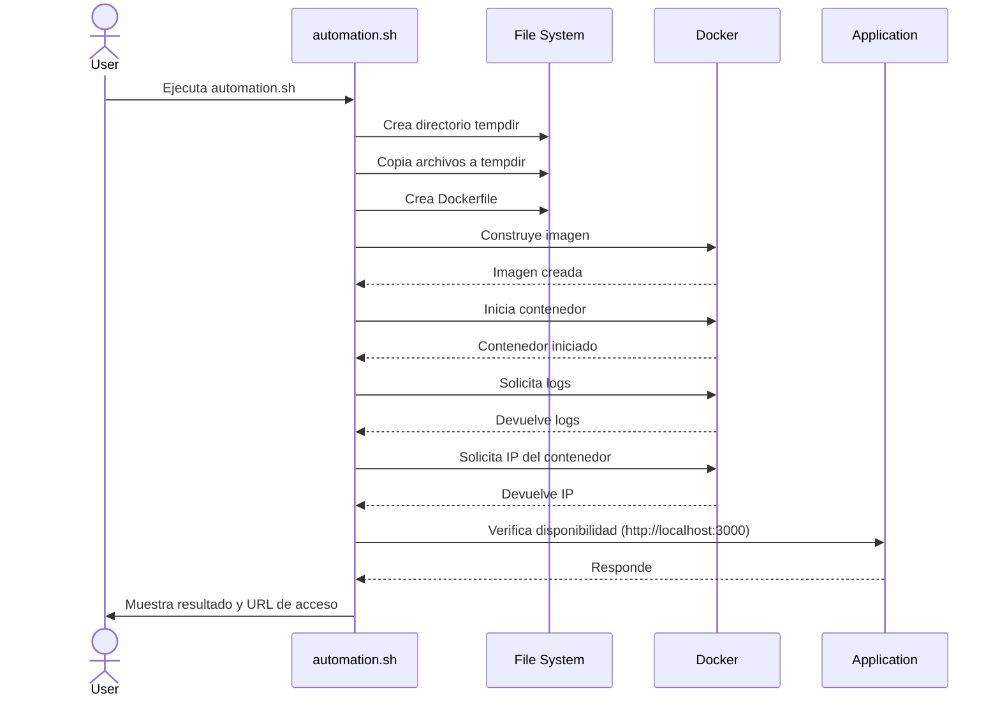

# Desafío DevOps I: Sistema de Gestión de Autos

## 🚗 Descripción

Este desafío consiste en automatizar el proceso de construcción y despliegue de una aplicación de gestión de autos. El objetivo es crear un script en Bash que automatice todo el proceso, desde la preparación del entorno hasta el despliegue de la aplicación en un contenedor Docker.




## 🛠 Tecnologías Utilizadas

- Bash scripting
- Docker
- Node.js
- Git

## 📋 Instrucciones

1. Haz un fork del repositorio y clónalo en tu máquina local:

   ```sh
   git clone https://gitlab.com/training-devops-cf/cf-cars-management-system.git
   cd cf-cars-management-system
   ```

2. Crea un script llamado `automation.sh` en el directorio raíz del proyecto. Este script debe realizar las siguientes tareas:

   2.1. Crear una estructura de directorios temporal:
   - Crear una carpeta llamada `tempdir`
   - Dentro de `tempdir`, crear subdirectorios `public` y `src`

   2.2. Copiar los archivos necesarios a la estructura temporal:
   - Copiar el contenido de las carpetas `public/` y `src/` a sus respectivos directorios en `tempdir`
   - Copiar los archivos `package.json`, `package-lock.json` (si existe) y `server.js` a `tempdir`

   2.3. Crear un `Dockerfile` dentro de `tempdir` con el siguiente contenido:

   ```Dockerfile
    FROM node:18-slim
    LABEL org.opencontainers.image.authors="RoxsRoss"
    RUN apk add --update python3 make bash g++\
    && rm -rf /var/cache/apk/*
    WORKDIR /app
    COPY package*.json ./
    RUN npm install
    COPY . .
    EXPOSE 3000
    CMD ["npm", "start"]
   ```

   2.4. Construir la imagen Docker:
   ```sh
   docker build -t cars-management-app .
   ```

   2.5. Iniciar un contenedor con la aplicación:
   ```sh
   docker run -d -p 3000:3000 --name cars-management-container cars-management-app
   ```

   2.6. Mostrar los contenedores activos:
   ```sh
   docker ps -a
   ```

   2.7. Si la construcción es exitosa, mostrar los logs del contenedor:
   ```sh
   docker logs cars-management-container
   ```

   2.8. Proporcionar instrucciones para validar la aplicación:
   - Indicar cómo acceder a la aplicación en `http://localhost:3000`
   - Mostrar cómo obtener la IP del contenedor:
     ```sh
     docker inspect -f '{{range.NetworkSettings.Networks}}{{.IPAddress}}{{end}}' cars-management-container
     ```

3. Asegúrate de que el script tenga permisos de ejecución:
   ```sh
   chmod u+x automation.sh
   ```

## 🌟 Criterios de Evaluación

- Funcionalidad: El script debe ejecutarse sin errores y completar todas las tareas especificadas.
- Robustez: Debe manejar posibles errores y proporcionar mensajes informativos.
- Claridad: El código debe estar bien comentado y ser fácil de entender.
- Eficiencia: El script debe optimizar los procesos donde sea posible.

## 🚀 Retos Adicionales (Opcional)

Para aquellos que quieran ir más allá, consideren implementar:

1. Verificación de dependencias al inicio del script (Docker, Node.js, etc.).
2. Limpieza de recursos anteriores (imágenes y contenedores antiguos) antes de comenzar.
3. Implementación de un sistema de logs para el script.
4. Parametrización del script (por ejemplo, permitir especificar el puerto o el nombre de la imagen).
5. Implementación de tests básicos para verificar el funcionamiento de la aplicación.

## 📬 Entrega

Para entregar tu solución:

1. Sube tu script `automation.sh` al repositorio.
2. Incluye cualquier documentación adicional o instrucciones especiales en un archivo `SOLUTION.md`.
3. Asegúrate de que tu repositorio sea público o proporciona acceso al evaluador.

¡Buena suerte y feliz coding! 🚀👨‍💻👩‍💻
