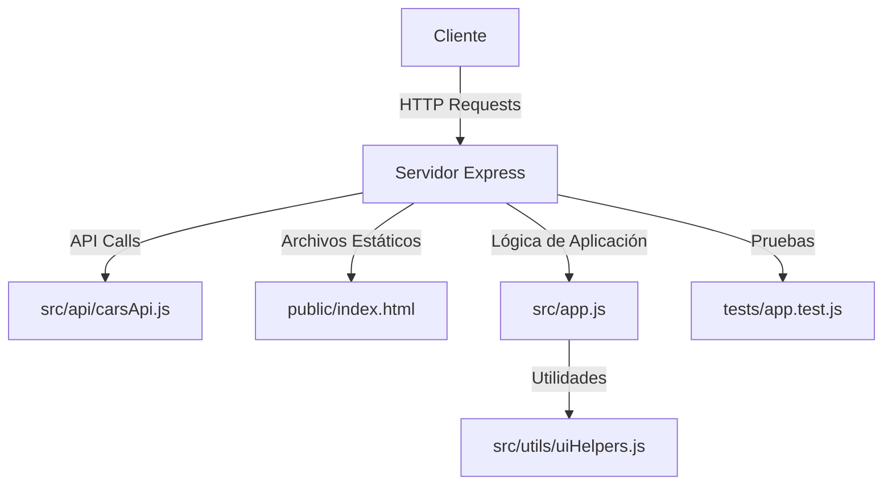

# Cars Management System by @roxsross
Este proyecto es un ejercicio para gestionar una lista de autos. Utiliza tecnologías como Express y Jest para crear una aplicación web simple que permite listar, agregar y buscar autos.




## Estructura del Proyecto

El proyecto está organizado de la siguiente manera:

- `src/`: Contiene el código fuente de la aplicación.
    - `api/`: Contiene las llamadas a la API.
        - `carsApi.js`: Funciones para gestionar los datos de los autos.
    - `app.js`: Lógica principal de la aplicación.
    - `utils/`: Contiene utilidades y funciones auxiliares.
        - `uiHelpers.js`: Funciones para manipular el DOM.
- `tests/`: Contiene las pruebas unitarias y de integración.
    - `app.test.js`: Pruebas para la lógica de la aplicación.
- `public/`: Archivos estáticos y recursos públicos.
    - `index.html`: Página principal de la aplicación.

## Pre-requisitos

Asegúrate de tener Node.js versión 18 instalada. Se recomienda usar `nvm` (Node Version Manager) para gestionar las versiones de Node.js.

### Instalación de `nvm`

1. Descarga e instala `nvm` siguiendo las instrucciones de su [repositorio oficial](https://github.com/nvm-sh/nvm#installing-and-updating).

2. Una vez instalado `nvm`, instala la versión 18 de Node.js:
    ```sh
    nvm install 18
    ```

3. Usa la versión 18 de Node.js:
    ```sh
    nvm use 18
    ```

4. Verifica que estás usando la versión correcta:
    ```sh
    node -v
    ```
    Deberías ver algo como `v18.x.x`.


## Instalación

1. Clona el repositorio:
    ```sh
    git clone https://gitlab.com/training-devops-cf/cf-cars-management-system.git
    cd cf-cars-management-system
    ```

2. Instala las dependencias:
    ```sh
    npm install
    ```

3. Inicia la aplicación:
    ```sh
    npm start
    ```

## Pruebas

Para ejecutar las pruebas, utiliza el siguiente comando:
```sh
npm test
```

## Ejecución en Contenedor

Para ejecutar esta aplicación en un contenedor Docker, sigue estos pasos:

### Dockerfile

Primero, crea un archivo llamado `Dockerfile` en la raíz del proyecto con el siguiente contenido:

```Dockerfile
FROM node:18-alpine
LABEL org.opencontainers.image.authors="RoxsRoss"
RUN apk add --update python3 make g++\
   && rm -rf /var/cache/apk/*
WORKDIR /app
COPY package*.json ./
RUN npm install
COPY . .
EXPOSE 3000
CMD ["npm", "start"]
```

### Construir la Imagen

Construye la imagen Docker con el siguiente comando:

```sh
docker build -t cf-cars-management-system:1.0.0 .
```

### Ejecutar el Contenedor

Ejecuta el contenedor con el siguiente comando:

```sh
docker run -p 3000:3000 cf-cars-management-system:1.0.0
```

Esto iniciará la aplicación en el puerto 3000. Puedes acceder a ella en `http://localhost:3000`.

### Verificar la Ejecución

Para verificar que el contenedor está corriendo correctamente, puedes listar los contenedores activos:

```sh
docker ps
```

Deberías ver algo como:

```
CONTAINER ID   IMAGE                      COMMAND                  CREATED          STATUS          PORTS                    NAMES
<container_id> cf-cars-management-system  "docker-entrypoint.s…"   X seconds ago    Up X seconds    0.0.0.0:3000->3000/tcp   <container_name>
```

## Contribuciones

Las contribuciones son bienvenidas. Por favor, abre un issue o envía un pull request.

